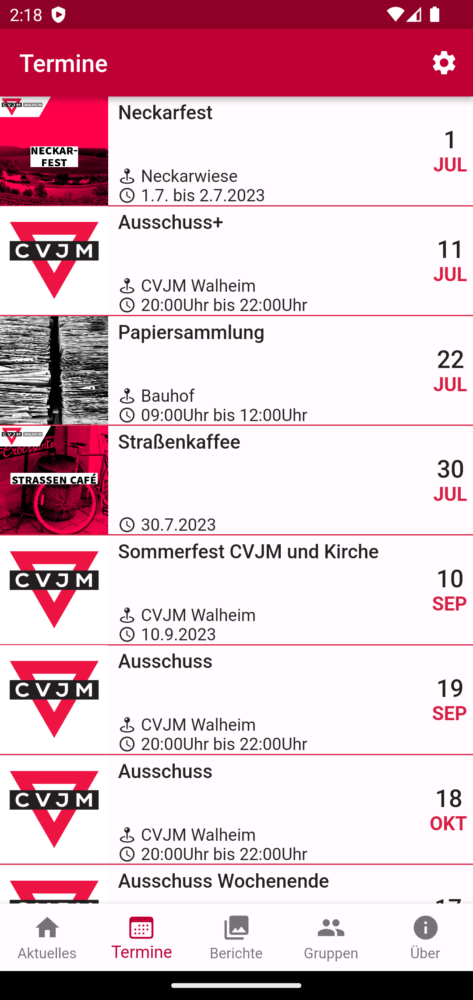
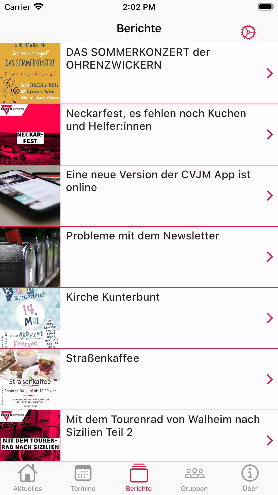
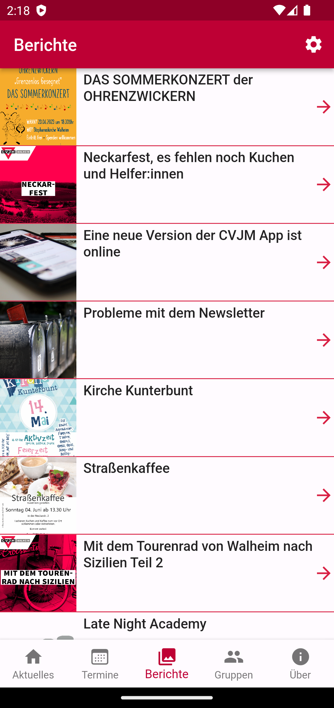
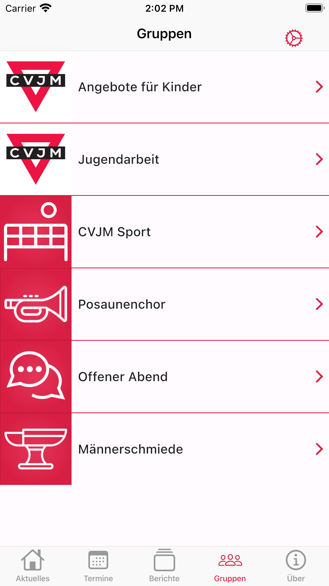
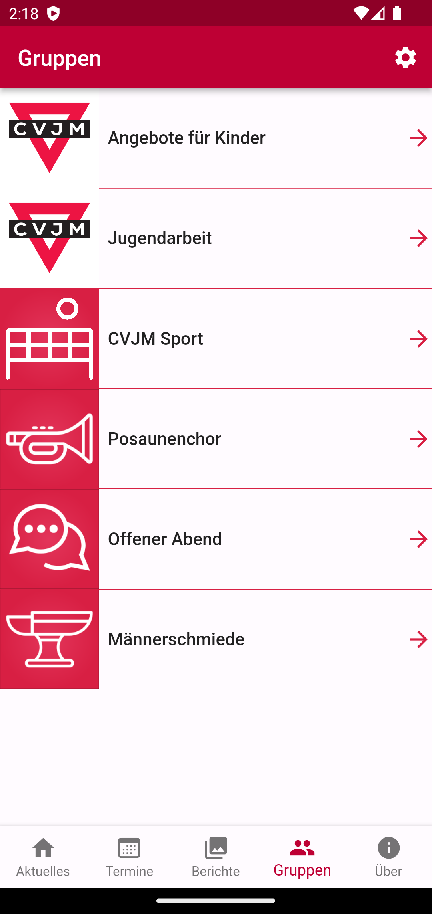
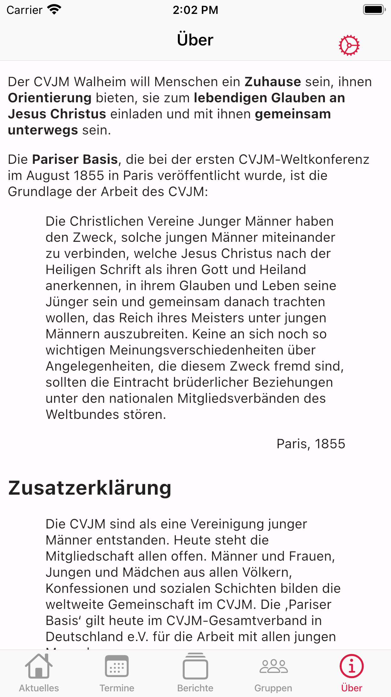
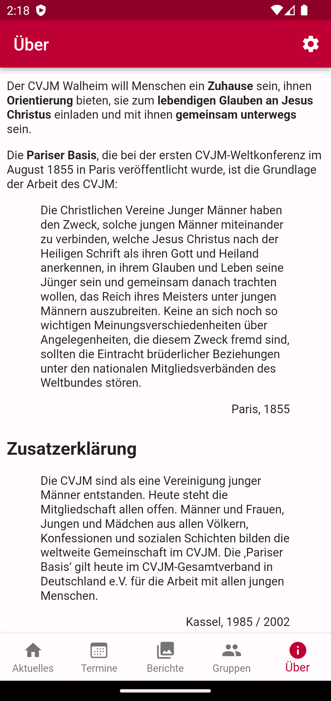

# CVJM Walheim App

## Idee

Diese App soll einen noch einfacheren Zugang zu den Daten des Vereins liefern. Dabei wurde darauf geachtet, dass die Wordpress Homepage des CVJM als Datenquelle/Backend fungiert, so dass eine doppelte Datenhaltung vermieden wurde.

## Funktionen

Die App soll für iOS sowie für Android bereitgestellt werden, weshalb Flutter die Grundlage für die App bildet. Es wird dabei darauf geachtet, dass die App unter beiden System so nativ wie möglich aussieht und sich auch so verhält. Weshalb bei der Enwicklung auf das Platform Widget zurückgegriffen wurde.
Im Endausbau soll die App folgende Funktionen aufweisen.

- [x] Anzeigen von wichtigen Nachrichten
- [x] Anzeigen der letzten Beiträge
- [x] Anzeigen der kommenden Veranstaltungen (Wordpress Plugin notwendig)
  - [x] Veranstaltungen zum Kalender hinzufügen
  - [x] Karten der Veranstaltung öffnen
  - [ ] Kalenderansicht
- [x] Teilen Button für Veranstaltungen und Nachrichten
  - [x] Mit Titelbild
  - [ ] Formatieren von Notizen in Kalenderinfo
- [x] Seiten der Gruppen und Kreise anzeigen (Wordpress Plugin notwendig)
  - [x] Featured Image in Gruppenansicht anzeigen
- [ ] Feedback Button für Probleme und Ideen
- [ ] Notifications damit alle Mitglieder über diese App erreicht werden können
- [ ] Notifications für anstehende Veranstaltungen
- [x] Neuer About-Dialog mit allen Paketen implementiert
- [ ] Filter für Posts und Veranstaltungskategorien
- [ ] Tablet Ansicht mit zwei Spalten (Master Detail) 
- [x] HTML Ansicht
  - [x] Emailadressen öffnen
  - [x] URLs öffnen
  - [x] Zitate formatieren
- [x] Zeige Über Tab an

## Vorschau

Stand 27.06.2023 HomeScreen sowie PostScreen sind bereits umgesetzt.

| iOS                                    | Android                                        |
| -------------------------------------- | ---------------------------------------------- |
| Start                                  |
|   |   |
| Termine                                |
|  |  |
| Beiträge                               |
|   |   |
| Gruppen                                |
|  |  |
| Über                                   |
|   |   |

